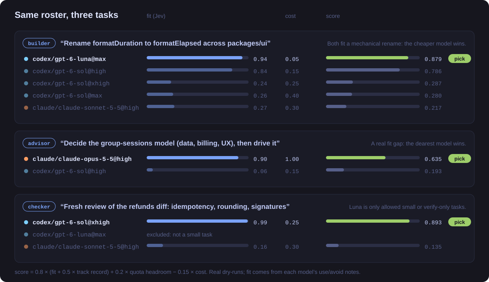
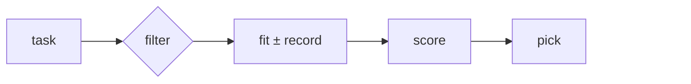

<p align="center">
  
</p>

<p align="center">
  <b>The right model for every task your coding agents hand off.</b><br>
  It weighs each model's fit for the task, what it costs against your subscriptions, how much quota
  is left,<br>and how its reviewed work has gone. Then it picks one, and tells you why.
</p>

<p align="center">
  <a href="https://github.com/nourhelmi/agent-router/actions/workflows/ci.yml"></a>
  <a href="LICENSE"></a>
  
  
  
  <a href="https://github.com/nourhelmi/crew"></a>
</p>

<p align="center">
  <a href="#quickstart">Quickstart</a> ·
  <a href="#how-it-works">How it works</a> ·
  <a href="#your-roster">Your roster</a> ·
  <a href="#learning-from-review">Learning</a> ·
  <a href="#quotas">Quotas</a> ·
  <a href="#library">Library</a> ·
  <a href="#cli">CLI</a> ·
  <a href="#faq">FAQ</a>
</p>

<br>

<p align="center">
  
</p>

## Why agent-router

Agents that delegate pick a model by habit, usually the one they're running on. In one real
workstream, seven Opus lead agents launched 60 helpers, and every one ran on Opus. That burned
half a week of the smaller subscription while the bigger one sat at 12%. The fix isn't "always
use the best model" or "always the cheapest". It's **the cheapest model that fits this task**,
checked against what you have left.

| | |
|---|---|
| **Fit, per task** | [Jev](https://typesafe.ai), a small typed-judgment model, scores each candidate's written guidance against the task, with a probability distribution and a confidence. |
| **Cost you set** | Each model gets a cost from 0 to 1: the share of your limits one assignment burns. Near-ties go to the cheaper model; a real fit gap still wins. |
| **Live quota** | Reads Codex and Claude rate-limit windows. It never routes into a window past its reserve, and an unobserved window counts as unknown, never as zero used. |
| **Learns from review** | Checker verdicts and parent grades build a decaying track record per model and role, which moves future fit. |
| **Scoped models** | A cheap model can be limited to small or verification-only tasks. |
| **Explains itself** | Every decision lists every candidate: why it was eligible or not, its fit distribution, cost, headroom and track record. |
| **Boring to run** | Node 24, zero runtime dependencies, built-in `node:sqlite`, private `0600` files, no daemon. |

## Quickstart

```sh
git clone https://github.com/nourhelmi/agent-router.git && cd agent-router
npm ci && npm test && npm link

agent-router init --roster ~/.config/crew/roster.json --codex  # your models
agent-router auth typesafe          # reads TYPESAFE_API_KEY; never prints it

echo '{"role": "builder", "harness": "native",
       "task": "Rename formatDuration across packages/ui"}' \
  | agent-router route --file - --dry-run
```

With [crew](https://github.com/nourhelmi/crew), you don't call it yourself: every `crew spawn` asks
the router, and `crew roster` (or the `/crew:roster` skill) manages the same roster file. Any caller
that speaks the [library](#library) or [CLI](#cli) contract works.

No TypeSafe key? Routing still works: each model's fit falls back to its `prior`, and cost, quota
and track record decide.

## How it works



1. **Filter.** Disabled models, the wrong role or harness, a pin that names another model, a quota
   window inside its reserve, and a scoped model on a task Jev can't confirm is small are all out.
2. **Judge.** One batched Jev request scores every remaining model's guidance against the task on a
   five-level rubric, and classifies the task (coding or general; small; verification-only). Only the
   task text, the role and your guidance leave the machine: no environment, quotas, account details
   or history. Don't put secrets in task text.
3. **Adjust.** Fit moves by the model's reviewed track record in this role, and optionally by mapped
   benchmark percentiles. A score below Jev's confidence floor falls back to the model's prior.
4. **Score.** `0.8 × quality + 0.2 × quota headroom − costWeight × cost`. Ties go to roster order.
5. **Commit.** Quotas and leases are rechecked, and the decision is recorded atomically with every
   candidate's diagnostics. `--dry-run` reserves no lease.

The weights are explicit heuristics, not calibrated probabilities. Check the picks on real tasks
before you trust them (the roster workflow below does exactly that).

## Your roster

The roster is the list of models you can run, per role, in preference order: a plain file you edit
by hand. The config's `rosterFile` points at it, and it's re-read on every route.

```json
{ "models": [
  { "model": "codex/gpt-6-sol", "effort": "high",
    "roles": ["advisor", "builder"], "cost": 0.15,
    "about": "the workhorse",
    "use": "implementation whose approach is clear; lanes that run a known plan",
    "avoid": "open product or architecture decisions; subtle money logic" },
  { "model": "claude/claude-opus-5-5", "effort": "high",
    "roles": ["advisor", "builder"], "cost": 1,
    "about": "the strongest judgment",
    "use": "lanes whose hard part is deciding what to build; greenfield UX",
    "avoid": "work whose approach is already decided; review" },
  { "model": "codex/gpt-6-luna", "effort": "max",
    "roles": ["builder", "checker"], "cost": 0.05,
    "use": "mechanical edits with an exact spec; scripted checks",
    "avoid": "judging evidence, review, debugging",
    "scope": "small-or-verification" }
] }
```

| Field | Meaning |
|---|---|
| `model` | `<host>/<model id>`. The host names the quota pool (override with `pool`). A host with no configured pool gets one that isn't penalized for being unobserved. |
| `effort` | The reasoning effort this entry runs at. List a model twice for two efforts. |
| `roles` | Which of `advisor`, `builder`, `checker` it may take. |
| `cost` | 0 (cheapest) to 1 (dearest). See [Cost](#cost). |
| `about`, `use`, `avoid` | The guidance Jev judges. |
| `scope` | `"small-or-verification"`: see [Task scope](#task-scope). |
| `prior`, `enabled` | Fit when Jev is unsure or unavailable (default `0.7`), and an off switch (default on). |

**Write `avoid` for every model.** Jev scores each model against its own guidance, so if every entry
sounds good at everything, they all score about 0.9, and quota headroom quietly picks for you. Naming
what a model is worse at is what spreads the scores out. Then try 5–10 of your real tasks with
`route --dry-run` and adjust until the picks match what you'd choose.

`agent-router init --roster FILE` sets up a new config around a roster; `agent-router roster use
--file FILE` switches an existing one.

## Cost

Headroom isn't cost: a pool with plenty of room can still be the expensive way to do a task. A
model's `cost` is the share of your limits one assignment burns. That folds in both how hungry the
model is and how big that subscription is: the same model is dearer on a small plan. With
`policy.costWeight: 0.15`, a model at cost 1 needs about 0.16 more fit than one at cost 0 to win.
With cost switched on, an unpriced model counts as cost 1 and says `cost-unset`. Costs are your
judgment, not token prices.

## Learning from review

Callers report reviewed results, and routing learns from them:

```sh
agent-router outcomes record --file outcome.json   # an object or an array
agent-router outcomes stats                        # track record per model and role
```

An outcome names the `model`, `thinking`, `role`, a `signal` (`review` is a checker's verdict on
that work; `grade` is the dispatching parent's) and `success`, plus a caller-unique `id` (recording
it again replaces it, so a grade can be revised), `at`, `source`, and optional `run` and `note`. A
worker's own "done" is not an outcome.

Per model and role, outcomes form a Beta posterior centred on the model's `prior`, worth
`outcomePrior` pseudo-observations (default 6). Each outcome counts half as much every
`outcomeHalfLifeMs` (default 30 days). Fit moves by `outcomeWeight × (posterior − prior)`. A model
with no outcomes keeps its fit, and outcomes for models outside the roster are kept but unused.
crew records both signals for you: a checker spawned with `--checks <run>`, and `crew grade`.

## Task scope

`scope: "small-or-verification"` admits a model only when Jev says, with probability at least 0.9,
that the whole task is small and tightly bounded, or that its deliverable is verification only. The
two judgments are kept separate, never averaged. A checker role, a high fit, a benchmark or a pin is
not permission. If the judgment is missing, uncertain or unavailable, the model is out
(`task-scope-unconfirmed`) and the others still route.

## Quotas

Each pool (a subscription) can have a collector:

- **Codex:** `init --codex` reads rate limits straight from the installed Codex CLI (a short
  `codex app-server --stdio` exchange). It needs no GUI or daemon and never touches Codex's
  credentials.
- **Claude:** pipe fresh Claude Code status-line data into `quota statusline --pool claude`, ingest
  normalized snapshots, or use the optional CodexBar collector (`init --codexbar`).

A window within `reservePercent` of full excludes its pool's models. Windows are never averaged, and
an expired or missing window is unknown, not free. Unknown quota follows the pool's policy:
`penalize` (default: −0.2), `allow`, or `exclude`.

<details>
<summary><b>Quota semantics in detail</b></summary>

- **Freshness.** Defaults: a 5-minute quota age and a 1-minute retry cooldown. For one-minute
  observations, set `quotaMaxAgeMs: 60000` and `refreshCooldownMs: 15000`. No background polling.
- **Account binding** is a deployment assertion: a pool's collector must observe the account its
  workers use. Snapshots carry a digest of collector, provider, source, account, window scopes and
  home directory, and evidence is kept per `(pool, binding)`. Changing the binding makes old
  snapshots ineligible until a matching one arrives. Multi-account merging is refused.
- **Scoped windows.** `collector.windowModels` maps named windows to exact model ids; `[]` marks a
  window irrelevant. Scopes are never guessed from aliases. "Primary" doesn't necessarily mean five
  hours: durations come from the provider.
- **Permissions.** Explicit provider denials stay restrictive through missing updates, staleness and
  resets until the same binding reports recovery. Only a strictly newer explicit allow recovers.
  Equal-time contradictions deny. Percentages above 100 stay exhausted.
- **Ordering.** Direct Codex reads use the database-admitted start time and a per-binding refresh
  token, so a delayed older response can't pose as newer recovery. Failed collection never freshens
  old evidence. Imports never inherit read-token authority.
- **Cache.** Distinct same-time window views are all kept, with deterministic `quota-view:N` ids for
  conflicts; nothing is averaged or synthesized. Migration is additive, and legacy rows merge on open.
- **CodexBar** can't reconstruct fields it doesn't expose, and a failing CLI source doesn't prove
  the GUI or login is broken. A percentage is not proof a provider will accept a request.

</details>

## Benchmarks (optional)

Public leaderboards can nudge fit (`benchmarkWeight`, default 0.15, at most 0.5), but only through
explicit, evidence-backed mappings from a leaderboard row to a roster entry at the same effort. In
practice they rarely separate frontier models, and they lag new releases. Their best use is a cold
start for a model you haven't tried; your own track record takes over from there.

```sh
agent-router benchmarks refresh --source deepswe
agent-router benchmarks refresh --source artificial-analysis   # public page, no key
agent-router benchmarks list
agent-router benchmarks map --candidate 'codex/gpt-6-astra@xhigh' \
  --source deepswe --model gpt-6-astra --metric pass_at_1 \
  --variant mini-swe-agent:xhigh:mini_swe_agent_gpt_6_astra_xhigh \
  --cohort v1.1:113:mini-swe-agent:xhigh --evidence-url https://…
```

<details>
<summary><b>Benchmark sources, storage and licensing</b></summary>

- Routing never fetches: it reads a private local snapshot (`benchmarkFile`, `0600`, written
  atomically) and caches validated rows in SQLite. Refresh by hand, one command at a time. Malformed
  or empty files fail rather than erase the cache; failed refreshes keep the last good snapshot.
- **[DeepSWE](https://deepswe.datacurve.ai/)**: only rows covering all 113 tasks enter a cohort, split
  by harness and reasoning effort. Pass@1 and pass@4 are never conflated.
- **[Artificial Analysis](https://artificialanalysis.ai/models)**: the page's published Intelligence
  Index chart (a selection, not the full catalog), with its exact variants and methodology version.
  `--api` uses the authenticated Free API instead, with separate Intelligence, Coding and Agentic
  metrics (needs `ARTIFICIAL_ANALYSIS_API_KEY`).
- Mappings need an exact cached row and an HTTPS evidence URL. Similar names aren't joined
  (`gpt-5.6-sol` ≠ `gpt-5-6-sol`), and one effort's score never stands in for another's. Unmapped
  or stale evidence is neutral, never a silent zero. Coding benchmarks apply only when Jev
  confidently calls the task coding. Mappings need an inline catalog, not a roster file.
- Public doesn't mean redistributable. Artificial Analysis's
  [terms](https://artificialanalysis.ai/docs/legal/Terms-of-Use.pdf) restrict automated collection
  and redistribution, and its Free API is internal-use only. This package ships code and synthetic
  fixtures, no fetched data; keep snapshots private and attributed.

</details>

## Library

```ts
import { route, renew, release } from '@nourhelmi/agent-router';

const decision = await route({
  role: 'builder',
  task: 'Implement the parser and verify malformed-input handling.',
  harness: 'native',
  requestId: 'unique-attempt-id',
  // pin: { model: 'codex/gpt-6-sol', thinking: 'xhigh' },
});

// Launch exactly decision.selected.model at decision.selected.thinking.
// Renew the lease while the worker runs; release it once it has stopped.
await renew(decision.id);
await release(decision.id);
```

A decision carries the exact pick, its strategy (`jev`, `fallback` or `pinned`), a lease id and
expiry, task and catalog digests, the policy and quota snapshots used, the Jev version, and every
candidate's reasons, scores, distributions, scope judgments, cost, track record and benchmark
provenance.

<details>
<summary><b>Pins, leases and failure modes</b></summary>

- A model-only pin lets the router choose that model's effort. No pin overrides quota, capability or
  scope rules or adds a model the roster lacks. Unscoped pins skip Jev; scoped pins still need its
  judgment. `worker` and `freeform` roles use builder guidance.
- `AGENT_ROUTER_NO_FEASIBLE_ROUTE` is terminal for that launch, not permission to pick another model.
  An enabled but invalid config never silently bypasses the router.
- SQLite transactions serialize leases across local processes. The same request id with the same
  inputs returns the same live lease; changed inputs or a settled id are rejected. Renewal never
  resurrects an expired or released lease. The default lease is five minutes.
- Leases are bookkeeping, not a concurrency cap: live counts are shown but never exclude or penalize
  a model, and they don't reserve provider quota. Legacy `maxConcurrent` fields are ignored.
- Config and module paths belong to trusted installation settings, never to task arguments.

</details>

## CLI

| Command | Does |
|---|---|
| `init [--roster FILE \| --profiles DIR] [--codex \| --codexbar]` | Create a config (never overwrites). |
| `roster use --file FILE` | Point an existing config at a roster file. |
| `roster check [--file FILE]` | Validate a roster (default: the config's) and name any entry and field that is wrong. |
| `route --file REQUEST.json [--dry-run]` | Pick a model. `--file -` reads stdin; `--dry-run` reserves nothing (it still refreshes quotas and calls Jev). |
| `renew ID`, `release ID` | Manage a lease. |
| `status` | Quotas, leases, roster file and benchmark coverage. |
| `quota refresh` · `quota ingest` · `quota statusline --pool P` · `quota codexbar --pool P` | Collect or import quota snapshots. |
| `outcomes record --file F` · `outcomes stats` | Report reviewed results; show track records. |
| `benchmarks refresh \| import \| export \| list \| map` | Manage the private benchmark snapshot. |
| `auth typesafe \| artificial-analysis` | Save a key from the environment, privately. |

Commands print JSON and take `--config FILE` (default `AGENT_ROUTER_CONFIG`, then
`~/.config/agent-router/config.json`). Credentials and the SQLite state live beside the config,
outside the checkout, as `0600` files in a `0700` directory. Environment keys beat the credentials
file. Audits omit task text and credentials; task digests are pseudonymous, not anonymous, and old
rows are yours to prune.

## Configuration

`policy` in the config:

| Key | Default | |
|---|---|---|
| `capacityWeight` | `0.2` | Weight of quota headroom in the score. |
| `costWeight` | `0` | Utility subtracted per unit of cost. `0.15` is a good start. |
| `outcomeWeight` | `0` | How far track record can move fit. `0.5` is a good start. |
| `outcomePrior` | `6` | Pseudo-observations before a track record dominates. |
| `outcomeHalfLifeMs` | 30 days | Age at which an outcome counts half. |
| `benchmarkWeight` | `0.15` | Weight of mapped benchmarks (at most `0.5`). |
| `benchmarkMaxAgeMs` | 90 days | Older benchmark rows are ignored. |
| `unknownPenalty` | `0.2` | Subtracted for unknown quota in a `penalize` pool. |
| `quotaMaxAgeMs` · `refreshCooldownMs` · `refreshTimeoutMs` | 5 min · 1 min · 20 s | Quota freshness. |
| `leaseMs` | 5 min | Lease lifetime. |

Pools set `reservePercent` (default 10), an `unknown` policy and an optional `collector`. `jev` sets
`model` (default `jev-latest`, or pin a version), `timeoutMs` and `minConfidence` (default `0.35`).

<details>
<summary><b>Importing Pi intelligence profiles</b></summary>

Without `--roster`, `init` imports the union of `~/.pi/agent/intelligence-profiles/*.json`: every
model and effort they declare, deduplicated, with their guidance and provenance. Recommendations set
tie-break ranks per role but not eligibility. Priors start at a neutral `0.7`, and the active profile
only sets tie-break preference. Later profile switches don't rewrite the config. Imported Cursor
candidates are Pi-only; a candidate's `harnesses` list is its only transport restriction. Merging
several profiles tends to make every model sound "preferred", which is why a hand-written roster
routes better.

</details>

## What it doesn't do

It picks and explains. It never launches agents, edits prompts, switches accounts, reads project
files, changes your running model, logs in, spends reset credits, or turns on paid fallback. It
doesn't cap how many workers you run.

## FAQ

<details>
<summary><b>Do I need a TypeSafe API key?</b></summary>

No. Without Jev, each model's fit is its `prior`, so cost, quota and track record decide, and scoped
models are simply never admitted. Jev is what makes the pick task-aware.
</details>

<details>
<summary><b>Why not always use the best model?</b></summary>

Because it's the scarcest. The best model on a mechanical rename costs you the capacity you'll want
for the design decision tomorrow. The hero above is three real picks from one roster.
</details>

<details>
<summary><b>Do I need benchmarks?</b></summary>

No. They're off unless you map them, they rarely separate frontier models, and they lag releases.
Your own reviewed outcomes are the better signal.
</details>

<details>
<summary><b>Does it work without crew?</b></summary>

Yes. crew is one caller. Anything that can run the CLI or import the library can route with it; the
roster format and the outcome contract are documented above.
</details>

## Verification

`npm test` builds and runs the offline suite: eligibility, quota edge cases (unknown, stale, scoped,
over-limit, conflicting), pins, Jev schema and failure handling, rosters, cost, outcomes, benchmark
mappings, idempotent and non-resurrecting leases, CLI behavior, private file permissions and package
contents. No test needs a provider credential; live checks against Jev, quotas and leaderboards are
separate.

## Contributing

Issues and pull requests are welcome. Keep it dependency-free and fail-closed: evidence the router
can't verify stays unknown, never assumed. Run `npm test` and `npm run typecheck` before sending.

## License

[MIT](LICENSE)
